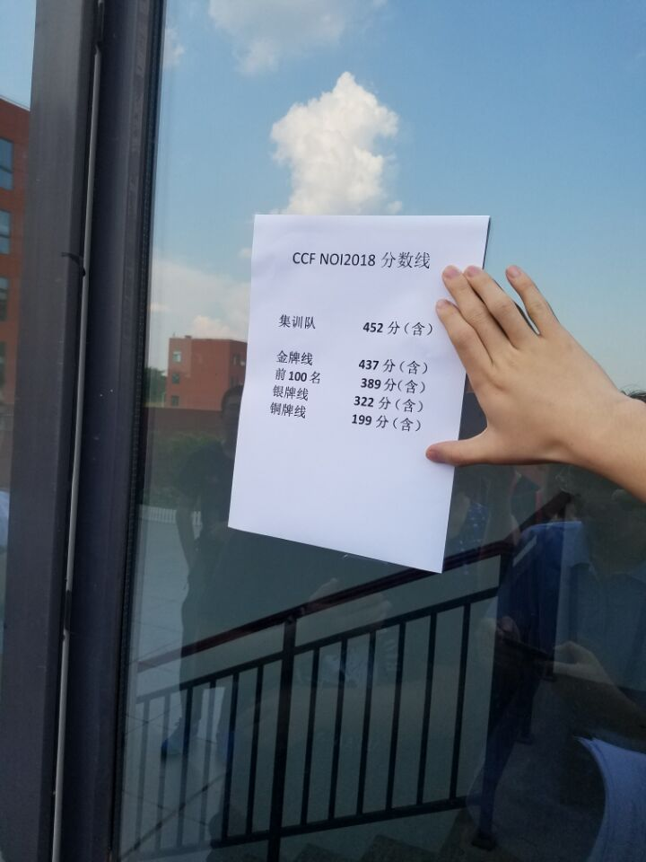

# NOI 2018 银滚记

### Day 0

考笔试，考完立刻出分，真刺激。

看题感觉和 judge-duck 上的没什么两样，很快做完了又检查了一遍。

然后得了 $99$ 分。第 $49$ 题：

```
下列哪些是 NOI 提供的编程工具：
A. GUIDE
B. Anjuta
C. Lazarus
D. Gedit
```

然后我义无反顾的选了 ABC。然后答案是 ABCD，因为题库这样写的：

```
NOI 提供的编程工具除了 GUIDE、Lazarus、Anjuta 等 IDE 外，还提供的编程工具是 Vi 和 Gedit。
```

……

完蛋。

### Day 1

进去以后看了三道题，觉得都可做，于是先开了 T2。

T2 开了半个多小时就糊了一个 $84$ 分算法，大致就是 DP 时记最大值，结果发现这个最大值的变化和卡特兰数那个三角形差不多。写了一个过了大样例。

然后开始搞 T1，看出来可以可持久化并查集，没想到 Kruskal 重构树。但是我可持久化并查集没写过几次，也许调不完，于是尝试拿离线和暴力的 $65+10$ 分。写了一个多小时，过了大样例于是先看了 T3。

T3 先研究了一段时间才终于看出一个 $68$ 分的 SA 做法，码了一个 SA 过了小样例过不了大样例。调了一会儿突然想起通知了求本质不同的串的答案，于是又赶紧再跑一遍 SA 去重，最后 12:51 的时候过了大样例。

T1 没有拍，总感觉要 FST。

估分是 $75+84+68=227$。然后佬咕 $268$，司咕 $>268$。

下午查分发现 T1 果然挂了。

$15+84+56=155$。研究了一下 T3 挂的是卡常，然后 T1 不知道咋挂了。

看了一会儿发现我是个沙冰。

```c++
for (int i = 1; i <= q; i++) {
  Q[i].a = read();
  Q[i].b = read();
  Q[i].c = read();
  std::sort(Q + 1, Q + 1 + q);
}
```

关键是，关键是它居然过完了大样例。

崩盘了。

然后司机阿克了，佬 $268$。

### Day 2

进去以后看了三个题，觉得 T1 比较傻，T2 不可做。

推了几步发现就是个 crt，需要加个快速乘。于是码码码，一个多小时之后过了大样例。

然后开始推 T3，研究了一会儿发现 $k=1$ 可做，于是码，码完一遍发现推错了一点东西，于是又码，剩一个小时的时候过了大样例。

最后一个小时打了 T2 的 $n^3$ 暴力，发现 <samp>center4.in</samp> 里第一行有个 $19000$ 左右的数，以为是 $n$ 所以立马跑了，过了剩余几组大样例。

出来估分的时候咕的是 $100+15+50=165$。佬咕 $195$，司咕 $80\sim 220$，估计是写了大堆骗分。

然后一出来就听说了一堆人没开 `multiset`，没开居然也能过大样例。

查分的时候发现是 $85+0+50=135$，T1 是 T 了三个点，T2 的暴力直接挂了不知道为啥。

但是 T1 不开 `multiset` 还是有 $90$ 分，太恶心了。

最高分就是佬和栋 $195$，然后 yfz $165$，司 $115$。

### Day ?

我总分是 $99+155+135=389$，凉凉。

在自习室水群的时候突然看到一张图。



？？？

然后 ？？？

我不知道当时我是啥心情。

然后不知道给谁打了啥电话。

反正糊里糊涂就跑去排队。

然后就换了一个约。

？？？

然后我的 NOI 之旅就这么结束了。

D 类银牌滚粗了，完蛋了。

### After

要是 T1 那个傻逼错不犯那就是 D 类金牌的（虽然对我来说没什么用）。

然后这次进了三个队，佬捧了一个第三。


### Day ?

粉丝群聚会。

NOPL 2018。

特别好玩。

还面基了 zjt、Ciel、wxh114514、wxh0109810 等人。